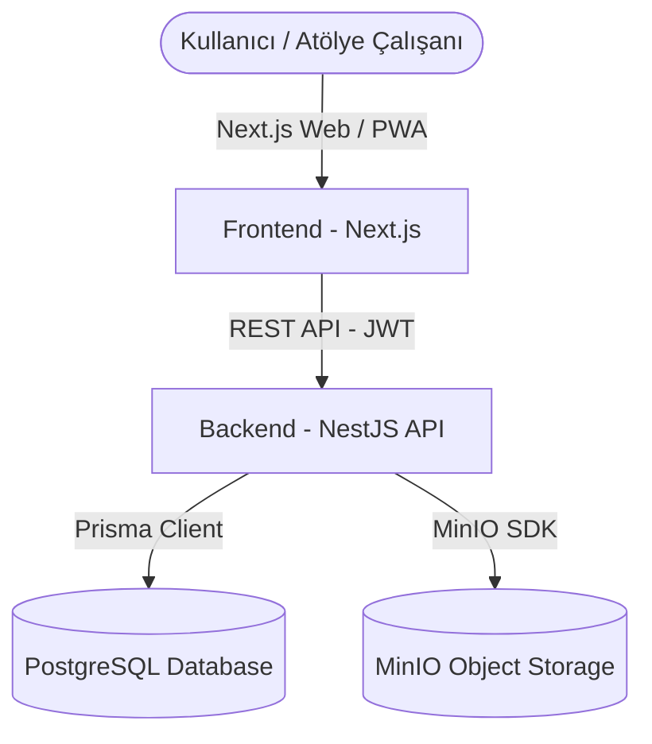
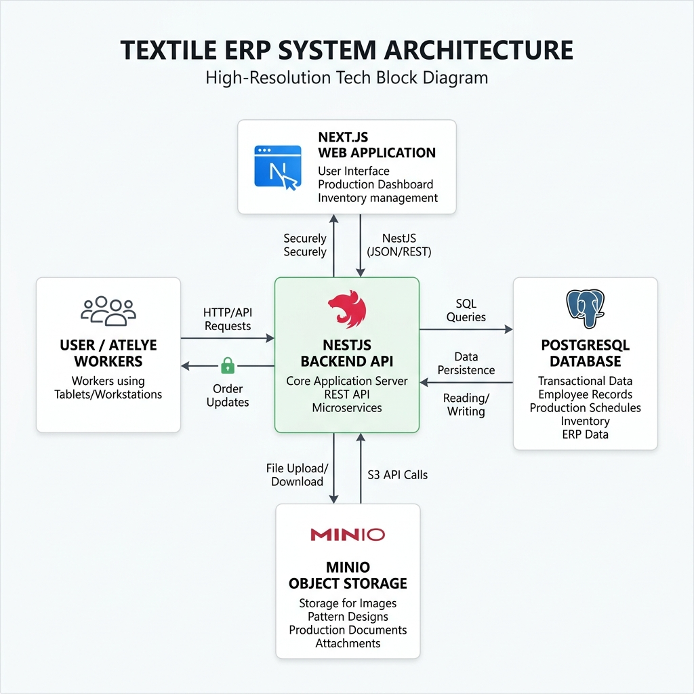
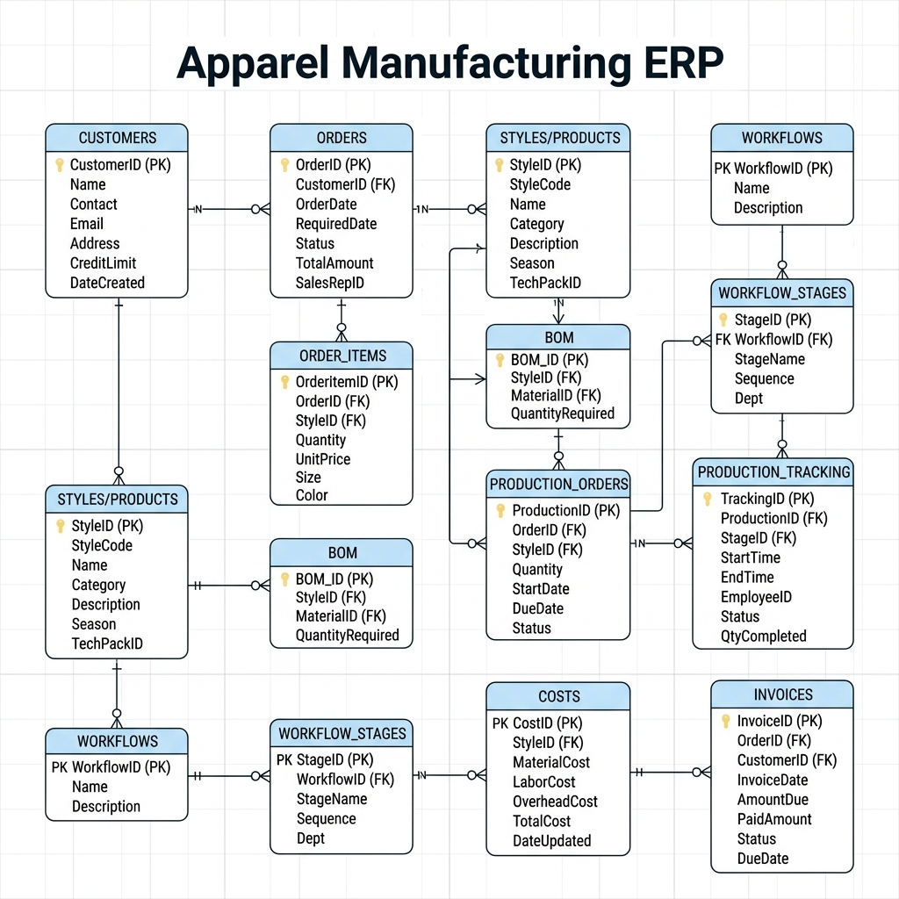

# Tekstil Üretim Takip ve Operasyon Yönetim Sistemi — Güncellenmiş Mimari Plan

Bu dokümanda, sistemin veri tabanı mimarisi, modüler yapısı, ilişkisel veri şemaları (Prisma modelleri) ve operasyonel iş akışları detaylandırılmıştır. Sistem; ölçeklenebilir, rol bazlı yetkilendirmeye (RBAC) sahip, multi-tenant (çoklu şirket) uyumlu ve uçtan uca izlenebilirlik sağlayan modern bir ERP mimarisi üzerine kurulmuştur.

---

## 1. Genel Sistem Mimarisi

Sistem 3 ana katmandan oluşmaktadır:
1.  **Frontend (Arayüz):** Next.js (TypeScript) + TailwindCSS tabanlı modern yönetim paneli arayüzü.
2.  **Backend (API Servisi):** NestJS (TypeScript) tabanlı modüler, güvenli ve performanslı REST API servisi.
3.  **Database (Veri Depolama):** PostgreSQL ilişkisel veri tabanı, **Prisma ORM** ile yönetilmektedir.





---

## 2. Mimari Katmanlar ve Modüller

Sistemin veri tabanı mimarisi altı ana dikey bileşene ayrılmıştır:

### A. Organizasyon ve Yetkilendirme (Auth & RBAC)
*   **Organization:** Çoklu şirket desteği (Multi-tenancy) için verilerin izole edildiği çatı model.
*   **User & Role & Permission:** Kullanıcıların sisteme giriş, JWT yetkilendirme ve rol bazlı yetki kontrolü (order:create, cutting:write vb.) yapmasını sağlayan RBAC modelleri.

### B. Dinamik İş Akışı (Workflow)
*   **WorkflowState:** Siparişlerin geçebileceği aşamalar (Maliyet, Numune, Kesim, Dikim, Ütü-Paket, Sevkiyat vb.). Renk ve ikon bilgileri UI için burada tutulur.
*   **WorkflowTransitionDef:** Aşamalar arasındaki geçiş kuralları (örn: Numune aşamasından Kesim aşamasına geçebilmek için fotoğraf yükleme veya not yazma zorunluluğu).
*   **WorkflowTransition (Log):** Bir siparişin aşama değiştirme geçmişinin kimin tarafından ne zaman yapıldığını tutan log tablosu.

### C. Sipariş Yönetimi (Order Management)
*   **Order (Ana Entity):** Ürün adı, miktarı, termin tarihi, para birimi, QR kodu ve maliyet/fiyat hesaplama özetlerini tutan merkezi model.
*   **OrderAssignment:** Siparişteki belirli rollerin (Örn: Modelist, Müşteri Temsilcisi) hangi kullanıcılara atandığını takip eder.

### D. Üretim ve Takip (Production Floor Tracking)
*   **SampleRecord & SampleCritique:** Numune iterasyonları (Numune 1, Numune 2) ve bunlara ait tasarım/ölçü kritiklerinin yönetimi.
*   **PatternInfo & MeasurementSet & Entry:** Modelistin hazırladığı kalıp notları, sarfiyat verileri ve beden bazlı (XS, S, M vb.) ölçü tabloları ile toleranslar.
*   **ProcurementItem:** Sipariş için tedarik edilmesi gereken kumaş, aksesuar, iplik gibi malzemelerin durum takibi (Bekliyor, Sipariş Edildi, Kısmi Geldi, Depoda).
*   **CuttingRecord:** Kesimhane verileri; pastal sayısı, serilen kumaş miktarı ve fire hesabı.
*   **ProductionRecord:** Dikimhane verileri; günlük dikilen adetler ve bant bazlı hatalı/defolu ürün adetleri.
*   **IroningPackingRecord:** Ütü ve paketleme adetleri ile koli/kutu bilgileri.
*   **ShippingRecord:** Sevkiyat detayları, kargo takip, paket sayısı, ağırlık ve nakliye masrafı.

### E. Maliyet ve Finans (Costing & Accounting)
*   **CostItem:** Siparişin hammadde, aksesuar ve işçilik maliyet kalemleri.
*   **PricingItem:** Maliyete eklenen şirket genel gider payları, kâr marjları ve indirimler.
*   **Invoice:** Alış ve satış fatura kayıtlarının basitleştirilmiş veri girişi.
*   **Account & AccountTransaction:** Müşterilerin ve tedarikçilerin borç, alacak ve bakiye takibini yapan Cari Hesap modülü.

### F. Destekleyici Modüller (Support Modules)
*   **Issue:** Üretim esnasında karşılaşılan tüm kalite, gecikme veya eksik malzeme sorunlarının görsel yüklenebilir takibi.
*   **FileAttachment:** MinIO üzerinde saklanan numune fotoğrafları, teknik föyler, fatura görselleri vb.
*   **TimelineEvent:** Siparişe dair yapılan tüm işlemlerin (maliyet güncellendi, kesim başladı, fatura girildi) kullanıcı adı ile tarihsel akışı.

---

## 3. İlişkisel Veritabanı Şeması (ERD)

Aşağıdaki şema, veri tabanındaki tabloların birbiriyle olan ilişkilerini ve siparişin (`Order`) nasıl bir merkezde konumlandığını göstermektedir:

```mermaid
erDiagram
    ORGANIZATION ||--o{ USER : contains
    ORGANIZATION ||--o{ ORDER : owns
    ORGANIZATION ||--o{ CONTACT : manages
    ORGANIZATION ||--o{ INVOICE : records
    ORGANIZATION ||--o{ ACCOUNT : tracks

    ROLE ||--o{ USER_ROLE : assigns
    PERMISSION ||--o{ ROLE_PERMISSION : defines
    USER ||--o{ USER_ROLE : has
    ROLE ||--o{ ROLE_PERMISSION : has

    CONTACT ||--o{ ORDER : places
    CONTACT ||--o{ PROCUREMENT_ITEM : supplies
    CONTACT ||--o{ ACCOUNT : holds

    WORKFLOW_STATE ||--o{ ORDER : represents
    WORKFLOW_STATE ||--o{ WORKFLOW_TRANSITION_DEF : "from/to state"

    USER ||--o{ ORDER : "created by"
    USER ||--o{ ORDER_ASSIGNMENT : "assigned to"
    ORDER ||--o{ ORDER_ASSIGNMENT : has
    ORDER ||--o{ WORKFLOW_TRANSITION : logs

    ORDER ||--o{ COST_ITEM : calculates
    ORDER ||--o{ PRICING_ITEM : determines
    ORDER ||--o{ SAMPLE_RECORD : requires
    ORDER ||--o{ SAMPLE_CRITIQUE : has
    ORDER ||--o{ PATTERN_INFO : guides
    ORDER ||--o{ MEASUREMENT_SET : specifies
    MEASUREMENT_SET ||--o{ MEASUREMENT_ENTRY : contains

    ORDER ||--o{ PROCUREMENT_ITEM : requests
    ORDER ||--o{ CUTTING_RECORD : tracks
    ORDER ||--o{ PRODUCTION_RECORD : tracks
    ORDER ||--o{ IRONING_PACKING_RECORD : tracks
    ORDER ||--o{ SHIPPING_RECORD : tracks
    ORDER ||--o{ INVOICE : references
    ORDER ||--o{ TIMELINE_EVENT : logs
    ORDER ||--o{ ISSUE : reports
    ORDER ||--o{ FILE_ATTACHMENT : holds

    ACCOUNT ||--o{ ACCOUNT_TRANSACTION : logs
    ACCOUNT ||--o{ INVOICE : links
    ISSUE ||--o{ ISSUE_COMMENT : contains
    USER ||--o{ ISSUE_COMMENT : writes
```





---

## 4. Kritik Veri Tabanı Modelleri (Prisma Detayları)

Aşağıda, sistemin temelini oluşturan kritik Prisma modellerinin alan yapıları ve veri tipleri sunulmuştur:

### 1. Sipariş Modeli (Order)
Sipariş tablosu hem ürün bilgilerini, hem üretim durumunu, hem de hesaplanan maliyet/fiyat özetlerini bir arada barındırır.

```prisma
model Order {
  id               String    @id @default(cuid())
  organizationId   String
  orderNumber      String    @unique    // SIP-2026-00001
  currentStateId   String
  createdById      String
  contactId        String?             // Müşteri (Contact type=CUSTOMER)

  // Ürün Bilgileri
  productName      String
  productCode      String?
  description      String?
  quantity         Int
  unit             String    @default("adet")
  colors           String?
  sizes            String?
  fabricType       String?
  fabricComposition String?

  // Termin & Öncelik
  deadline         DateTime?
  priority         Int       @default(2)  // 1: Acil, 2: Normal, 3: Düşük

  // İhracat / İç Piyasa
  marketType       String    @default("DOMESTIC") // DOMESTIC (İç Piyasa), EXPORT (İhracat)
  vatRate          Int       @default(10)          // 0, 1, 10, 20

  // QR/Barkod
  qrCode           String?
  barcode          String?

  // Finansal Özetler (Otomatik güncellenir)
  currency         String    @default("TRY")
  totalCost        Decimal?  @db.Decimal(12,2)  // Toplam maliyet
  unitCost         Decimal?  @db.Decimal(12,2)  // Birim maliyet
  profitAmount     Decimal?  @db.Decimal(12,2)  // Kâr tutarı
  profitMargin     Decimal?  @db.Decimal(5,2)   // Kâr marjı (%)
  offerUnitPrice   Decimal?  @db.Decimal(12,2)  // Müşteriye birim teklif fiyatı
  offerTotalPrice  Decimal?  @db.Decimal(12,2)  // Müşteriye toplam teklif fiyatı

  isActive         Boolean   @default(true)
  completedAt      DateTime?
  createdAt        DateTime  @default(now())
  updatedAt        DateTime  @updatedAt

  // İlişkiler
  organization     Organization  @relation(fields: [organizationId], references: [id])
  currentState     WorkflowState @relation(fields: [currentStateId], references: [id])
  createdBy        User          @relation("CreatedBy", fields: [createdById], references: [id])
  contact          Contact?      @relation(fields: [contactId], references: [id])
  costItems        CostItem[]
  pricingItems     PricingItem[]
  cuttingRecords   CuttingRecord[]
  productionRecords ProductionRecord[]
  timelineEvents   TimelineEvent[]
  issues           Issue[]
  // ... diğer ilişkiler
}
```

### 2. Dinamik İş Akışı Durum Geçişleri Modeli (WorkflowTransitionDef)
Süreçlerin kontrolünü ve otomasyonunu sağlayan geçiş tanımları tablosudur.

```prisma
model WorkflowTransitionDef {
  id               String   @id @default(cuid())
  fromStateId      String
  toStateId        String
  name             String            // Örn: "Maliyet Onayla", "Kesime Gönder"
  requiredRoles    String[]          // Bu geçişi yetkili kılacak roller
  requiresPhoto    Boolean  @default(false) // Fotoğraf zorunlu mu?
  requiresNote     Boolean  @default(false) // Not girişi zorunlu mu?
  requiresApproval Boolean  @default(false) // Yönetici onayı gerekir mi?
  autoAssignRole   String?           // Geçiş sonrası işin otomatik atanacağı rol
  sortOrder        Int      @default(0)

  fromState WorkflowState @relation("FromState", fields: [fromStateId], references: [id])
  toState   WorkflowState @relation("ToState", fields: [toStateId], references: [id])

  @@unique([fromStateId, toStateId])
}
```

### 3. Cari Hesap ve Hareket Modeli (Account & AccountTransaction)
Müşteri ve tedarikçilerin mali dengelerini tek bir çatı altında izleyen cari hesap yapısı.

```prisma
model Account {
  id              String    @id @default(cuid())
  organizationId  String
  contactId       String?   // Kişi kartı bağlantısı
  name            String
  type            String    // CUSTOMER veya SUPPLIER
  balance         Decimal   @default(0) @db.Decimal(12,2) // Cari bakiye
  currency        String    @default("TRY")
  isActive        Boolean   @default(true)
  createdAt       DateTime  @default(now())
  updatedAt       DateTime  @updatedAt

  organization    Organization @relation(fields: [organizationId], references: [id])
  contact         Contact?     @relation(fields: [contactId], references: [id])
  transactions    AccountTransaction[]
  invoices        Invoice[]
}

model AccountTransaction {
  id          String   @id @default(cuid())
  accountId   String
  type        String   // INVOICE, PAYMENT, COLLECTION
  direction   String   // DEBIT (Borç), CREDIT (Alacak)
  amount      Decimal  @db.Decimal(12,2)
  currency    String   @default("TRY")
  description String?
  date        DateTime
  createdAt   DateTime @default(now())

  account     Account @relation(fields: [accountId], references: [id], onDelete: Cascade)
}
```
